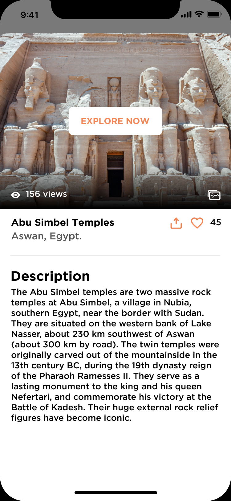

# AroundWorld

**AroundWorld** is a modern iOS app that helps users discover and explore the most unique travel experiences across Egypt.  
The app provides a seamless experience to browse recommended and recent places, search for destinations, and view detailed information with images and descriptions.

---

## Features

- 🚩 Discover recommended and recent experiences around Egypt
- 🔎 Search for experiences by name
- 🖼️ View beautiful photos and detailed descriptions
- ❤️ Like your favorite experiences
- 🌙 Clean and responsive SwiftUI interface

---

## Tech Stack

- **SwiftUI** – for fast, declarative UI development
- **MVVM Architecture** – ensures clean code, testability, and scalability
- **Unit Testing** – included for core app modules

---

## Screenshots

| Home Screen                            | Details Screen                          |
|-----------------------------------------|-----------------------------------------|
|            |      |

---

## Getting Started

1. Clone the repo:
    ```sh
    git clone https://github.com/Mahmoud-Abd-ElAziz/AroundWorld.git
    ```
2. Open the project in Xcode.
3. Build and run on your preferred simulator or device.
